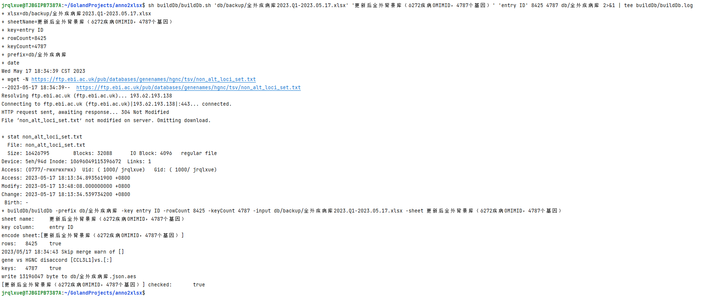
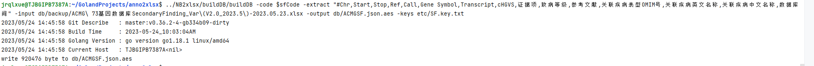
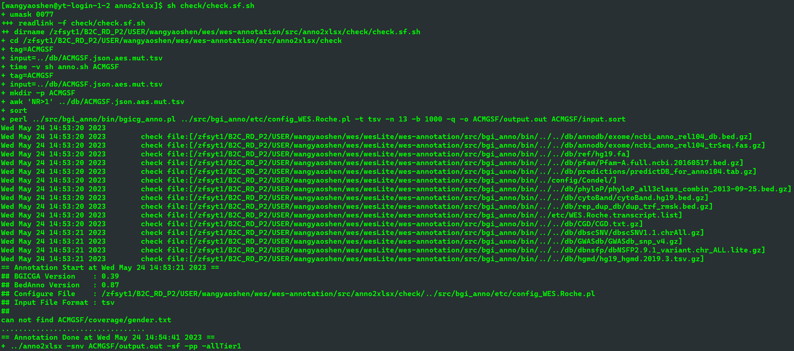

# anno2xlsx <!-- omit in toc -->

[](https://gitpod.io/#https://github.com/liserjrqlxue/anno2xlsx)
[](https://pkg.go.dev/github.com/liserjrqlxue/anno2xlsx)
[](https://goreportcard.com/report/github.com/liserjrqlxue/anno2xlsx)

- [USAGE](#usage)
  - [PARAM](#param)
- [处理逻辑](#处理逻辑)
  - [CNV](#cnv)
  - [Extra](#extra)
  - [fam\_info](#fam_info)
  - [FV](#fv)
    - [遗传相符](#遗传相符)
    - [familyTag](#familytag)
    - [筛选标签](#筛选标签)
  - [LOH](#loh)
  - [QC](#qc)
- [AES加密数据库](#aes加密数据库)
  - [DATABASE](#database)
  - [疾病库/基因频谱](#疾病库基因频谱)
  - [ACMG Secondary Finding](#acmg-secondary-finding)
    - [注释校验](#注释校验)
  - [VIPHL](#viphl)
- [CHPO](#chpo)
- [注意](#注意)
  - [特殊位点库](#特殊位点库)
- [特性](#特性)
  - [结合性处理](#结合性处理)
    - [格式转换](#格式转换)
    - [Het-\>Hom修正](#het-hom修正)
    - [Hom-\>Hemi修正](#hom-hemi修正)
- [复用拼接字段](#复用拼接字段)
- [注意](#注意-1)
- [UTIL](#util)
  - [`tier1tags`](#tier1tags)
    - [TO-DO](#to-do)

## USAGE

### PARAM

| arg          | type    | example                                         | note                                                                                 |
|--------------|---------|-------------------------------------------------|--------------------------------------------------------------------------------------|
| -json        | boolean |                                                 | 输出json格式结果                                                                           |
| -save        | boolean |                                                 | 保存excel                                                                              |
| -academic    | boolean |                                                 | 学术使用，比如REVEL数据库注释                                                                    |
| -hl          | boolean |                                                 | 使用耳聋变异库                                                                              |
| -nb          | boolean |                                                 | 使用新筛变异库                                                                              |
| -pp          | boolean |                                                 | 使用孕前变异库                                                                              |
| -sf          | boolean |                                                 | 使用ACMG SF变异库                                                                         |
| -acmg        | boolean |                                                 | 使用ACMG2015计算证据项PVS1, PS1,PS4, PM1,PM2,PM4,PM5 PP2,PP3, BA1, BS1,BS2, BP1,BP3,BP4,BP7 |
| -autoPVS1    | boolean |                                                 | 使用autoPVS1结果处理证据项PVS1                                                                |
| -allTier1    | boolean |                                                 | 不进行tier1过滤                                                                           |
| -allgene     | boolean |                                                 | tier1过滤不过滤基因                                                                         |
| -cnvAnnot    | boolean |                                                 | 重新进行UpdateCnvAnnot                                                                   |
| -cnvFlter    | boolean |                                                 | 进行 cnv 结果过滤                                                                          |
| -warn        | boolean |                                                 | 警告基因名无法识别问题，而非中断                                                                     |
| -wgs         | boolean |                                                 | wgs模式                                                                                |
| -couple      | boolean |                                                 | 夫妻模式                                                                                 |
| -trio        | boolean |                                                 | 标准trio模式                                                                             |
| -trio2       | boolean |                                                 | 非标准trio，但是保持先证者、父亲、母亲顺序                                                              |
| -redis       | boolean |                                                 | 使用redis服务注释本地频率                                                                      |
| -redisAddr   | string  | 127.0.0.1:6380                                  | redis服务器地址                                                                           |
| -cfg         | string  | etc/config.toml                                 | toml配置文件                                                                             |
| -geneId      | string  | db/gene.id.txt                                  | 基因名-基因ID 对应数据库                                                                       |
| -list        | string  | sample1,sample2,sample3                         | 样品编号，逗号分割，**有顺序**                                                                    |
| -gender      | string  | M,M,F                                           | 样品性别，逗号分割，与 -list 顺序一致                                                               |
| -qc          | string  | sample1.coverage.report,sample2.coverage.report | bamdst质控文件，逗号分割，与 -list 顺序一致                                                         |
| -filterStat  | string  | L01.filter.stat,L02.filter.stat                 | 计算reads QC的文件，逗号分割                                                                   |
| -imqc        | string  | sample1.QC.txt,sample2.QC.txt                   | 一体机QC.txt格式QC输入，逗号分割，过滤 -list 内样品列表                                                  |
| -mtqc        | string  | sample1.MT.QC.txt,sample2.MT.QC.txt             | 线粒体QC.txt，逗号分割，过滤 -list 内样品列表                                                        |
| -karyotype   | string  | sample1.karyotpye.txt,sample2.karyotype.txt     | 核型信息，逗号分割                                                                            |
| -loh         | string  | loh1.xlsx,loh2.xlsx                             | loh结果excel，逗号分割，按 -list 样品编号顺序创建sheet                                                |
| -lohSheet    | string  | LOH_annotation                                  | sheet name                                                                           |
| -kinship     | string  | kinship.txt                                     | trio的亲缘关系                                                                            |
| -snv         | string  | snv1.txt,snv2.txt                               | snv注释结果，逗号分割                                                                         |
| -exon        | string  | sample1.exon.txt,sample2.exon.txt               | exon CNV 输入文件，逗号分割，过滤 -list 内样品列表                                                    |
| -large       | string  | sample1.large.txt,sample2.large.txt             | large CNV注释结果，逗号分割                                                                   |
| -extra       | string  | extra1.txt,extra2.txt                           | 额外简单放入excel的额外sheets中                                                                |
| -extraSheet  | string  | sheet1,sheet2                                   | -extra对应sheet name                                                                   |
| -prefix      | string  | outputPrefix                                    | 输出前缀，默认 -snv 第一个输入                                                                   |
| -log         | string  | prefix.log                                      | log输出文件                                                                              |
| -tag         | string  | .tag                                            | tier1结果文件名加入额外标签，[prefix].Tier1[tag].xlsx                                            |
| -product     | string  | DX1516                                          | 产品编号                                                                                 |
| -seqType     | string  | SEQ2000                                         | redis 查询关键词，区分频率库                                                                    |
| -specVarList | string  | etc/spec.var.lite.txt                           | 特殊变异库                                                                                |

## 处理逻辑

### CNV

1. 读取 `annotation.Gene.transcript` , 得到基因-转录本对应关系
2. 读取 `CNV` 数据文件列表到 `paths`
3. 使用 `addCnv2Sheet(sheet, title, paths, sampleMap, filterSize, filterGene, stats, key, gender, cnvFile)` 写入 sheet
   - 读取 `paths` 到 `cnvDb`，遍历 `item`
      1. 跳过其他样品编号
      2. 一体机模式，进行表头处理
      3. `anno.CnvPrimer`进行引物设计
      4. `item["OMIM_Gene"]` 作为 基因，获取 `geneIDs`
      5. 基于 `geneIDs` 注释 `CHPO` `基因-疾病` `突变频谱`
      6. `-cnvAnnot` 时
         1. 转换 `json` 格式写入 `item["CNV_annot"]`
      7. `item["OMIM_Phenotype_ID"]` -> `item["OMIM"]`
      8. `-cnvFilter` 时
         1. `exon cnv` 跳过 `item["OMIM"]` 为空
         2. `large cnv` 跳过 `长度 < 1M`
      9. 基于 `title` 写入 `sheet row`
      10. `-wesim` 时
         1. 基于 `wesim.cnvColumn` 写入 `cnvFile`

### Extra

1. 解析 `-extra` 和 `-extraSheet` 到 `extraArray` `extraSheetArray`
2. 校验 `长度` 相等
3. 遍历 -> `i`
   1. 识别 `extraArray[i]` 后缀
      1. 后缀 `xlsx` 时，`AppendSheet` `extraSheetArray[i]` -> `extraSheetArray[i]`
      2. 其他时，作为 `txt` 读取 `slice` 写入 `sheet` `extraSheetArray[i]`

### fam_info

1. 写表头 "SampleID"
2. 遍历 `sampleList` -> `sampleID`
   1. `AddRow().AddCell().SetString(sampleID)` `sampleID` 写入 行

### FV

1. `loadData` 读取到 哈希数值 `data`
   1. 文件名后缀识别 是否 `gzip` 文件，分别读取
2. `cycle1`
   1. `data` 循环1 -> `item`
      1. `annotate1(item)`
         1. inhouse_AF -> frequency
         2. 历史验证假阳次数 <- "重复数"
         3. score to prediction
         4. update Function
         5. update FuncRegion
         6. gene symbol -> geneID
         7. 基于 `geneIDs` 注释 `CHPO` `基因-疾病` `突变频谱`
         8. 注释 孕前数据库
         9. 注释 新生儿数据库
         10. 注释 耳聋数据库
         11. "Omim Gene" -> "Gene"
         12. "OMIM_Phenotype_ID" -> "OMIM"
         13. `-acmg` 时
         14. `anno.UpdateSnv(item, *gender)`
         15. "引物设计"
         16. `item["flank"] += " " + item["HGVSc"]`
         17. "变异来源"
         18. 注释 Tier
         19. Tier1 时
           1. `anno.UpdateSnvTier1(item)`
           2. `anno.UpdateAutoRule(item)`
           3. `anno.UpdateManualRule(item)`
           4. `annotate1Tier1(item)`
3. `delDupVar`
   1. `data` 循环1 -> `item`
      1. `Tier1` 时
         1. "#Chr"+"Start"+"Stop"+"Ref"+"Call"+"Gene Symbol"+"Transcript" -> `key`
         2. `countVar[key] > 1` 时
            1. 加入 `duplicateVar[key]`
   2. 遍历 `duplicateVar` -> `key,items`
      1. 最大 `score = anno.FuncInfo[item["Function"]]` -> `maxFunc`
      2. 遍历 `items` -> `item`
         1. `score < maxFunc` 时
            1. `item["delete"] = "Y"`
            2. `deleteVar[key+"\t"+transcript] = true`
            3. `countVar[key]--`
            4. `continue`
         2. 最小 `transcriptLevel[transcript]` -> `minTrans`
      3. 遍历 `items` -> `item`
         1. `item["delete"] != "Y"` 且 `transcriptLevel[transcript] != minTrans`
            1. `item["delete"] = "Y"`
            2. `deleteVar[key+"\t"+transcript] = true`
            3. `countVar[key]--`
4. `cycle2`
   1. `data` 循环1 -> `item`
      1. `Tier1` 时 `anno.InheritCheck(item,inheritDb)`
         1. 统计 基因-转录本 维度 "Zygosity" "ModeInheritance" 分布计数
   2. `data` 循环2 -> `item`
      1. "ClinVar Significance" 拼接 "CLNSIGCONF"
      2. `Tier1` 时
         1. "MutationName" 记入 `tier1Db`
         2. "#Chr"+"Start"+"Stop"+"Ref"+"Call"+"Gene Symbol"+"Transcript" -> `key`
         3. 非 `deleteVar[key]`
            1. `annotate2(item)`
               1. `item["遗传相符"] = anno.InheritCoincide(item, inheritDb, *trio)`
               2. `item["遗传相符-经典trio"] = anno.InheritCoincide(item, inheritDb, true)`
               3. `item["遗传相符-非经典trio"] = anno.InheritCoincide(item, inheritDb, false)`
               4. `familyTag = "single"`
                  1. `-trio || -trio2` 时 `familyTag = "trio"`
                  2. `-couple` 时 `familyTag = "couple"`
               5. `item["familyTag"] = anno.FamilyTag(item, inheritDb, "trio")`
               6. `item["筛选标签"] = anno.UpdateTags(item, specVarDb, *trio, *trio2)`
               7. `anno.Format(item)`
                  1. `FloatFormat`
                     1. 6 位精度
                  2. `NewLineFormat`
                     1. `<br/>` -> `\n`
               8. `-wesim` 时 `annotate2IM`
                  1. "Gene Symbol" 属于 `acmgSFGene` 时 item["IsACMG59"] = "Y"
                  2. "DiseaseName/ModeInheritance" 拼接 "DiseaseNameCH"或"DiseaseNameEN"与"ModeInheritance"
                  3. `-trio` 时，拆分 "Zygosity" 给 "Genotype of Family Member 1" "Genotype of Family Member 2"
                  4. 基于 `wesim.resultColumn` 写入 `resultArray`
            2. 写入 Tier1 "filter_variants"
            3. 非 `-wgs` 时 写入 Tier2
      3. `outputTier3` 时
         1. `SteamWriterSetStringMap2Row(tier3SW, 1, tier3RowID, item, tier3Titles)`
            1. 流式写入 `Tier3`
5. `-wgs` 时 `wgsCycle`
   1. 初始化 `wgsXlsx`
      1. MTTitle 写入 "MT" Sheet，filterVaristsTitle 写入 "intron" Sheet
   2. `data` 循环1 -> `item`
      1. 重新计算 `wgs` 模式 `Tier1`
      2. `Tier1` 时 `anno.InheritCheck(item,inheritDb)`
         1. 统计 基因-转录本 维度 "Zygosity" "ModeInheritance" 分布计数
   3. `data` 循环2 -> `item`
      1. `Tier1` 时
         1. `annotate4(item)`
           1. `item["遗传相符"] = anno.InheritCoincide(item, inheritDb, *trio)`
           2. `item["遗传相符-经典trio"] = anno.InheritCoincide(item, inheritDb, true)`
           3. `item["遗传相符-非经典trio"] = anno.InheritCoincide(item, inheritDb, false)`
           4. `-trio`时 `item["familyTag"] = anno.FamilyTag(item, inheritDb, "trio")`
           5. `item["筛选标签"] = anno.UpdateTags(item, specVarDb, *trio, *trio2)`
         2. 写入 Tier2
         3. 额外（不在 `tier1Db` ） 非 "no-change" 变异
         1. 写入 `intronSheet`
      2. 线粒体 写入 "MT" Sheet

#### Tier

- trio
  - 先证者有检出
    - 自动化判断 不是 B/LB || 有证据项 PM2
      - denovo
        - 公共频率<=0.01
          - 基因集
            - 功能集
              - Tier1
            - WGS && 非 "no-change"
              - 本地频率<=0.01
                - Tier1
              - Tier2
            - Tier2
          - Tier2
        - Tier2
      - 非denovo
        - 公共频率<=0.01
          - 基因集
            - 功能集
              - Tier1
            - WGS && 非 "no-change"
              - 本地频率<=0.01
                - Tier1
              - Tier3
            - Tier3
          - Tier3
        - Tier3
- single
  - 自动化判断 不是 B/LB || 有证据项 PM2
    - 公共频率<=0.01
      - 基因集
        - 功能集
          - Tier1
        - WGS && 非 "no-change"
          - 本地频率<=0.01
            - Tier1
          - Tier3
        - Tier3
      - Tier3
    - Tier3
- HGMD DM || ClinVar P/LP
  - 非线粒体
    - 公共频率 <= 0.05
      - Tier1
    - 非 Tier1
      - Tier2
- 特殊位点库
  - Tier1

#### 遗传相符

#### familyTag

#### 筛选标签

- 标签拼接，分号 `;` 分割

- tag1:
  - 本地频率<=0.01 || 特殊变异库 || HGMD DM || ClinVar P/LP
    - trio
      - 遗传相符-经典trio == 相符
        - 标签 T1
      - 遗传相符-非经典trio == 相符
        - 遗传模式: AR || XL || YL
          - 标签 1
        - 遗传模式: AD
          - 频率和纯合记录 均为 0
            - 标签 1
    - single
      - 遗传相符 == 相符
        - 遗传模式: AR || XL || YL
          - 标签 1
        - 遗传模式: AD
          - 频率和纯合记录 均为 0
            - 标签 1

- tag2:
  - 特殊变异库 || HGMD DM || ClinVar P/LP
    - 标签 2

- tag3:
  - 本地频率<=0.01 || 烈性突变
    - 标签 3

- tag4:
  - 本地频率<=0.01
    - PP3 || (非重复区域+特定功能)
      - 标签 4
      - 特定功能:
        - stop-loss
        - cds-ins
        - cds-del
        - cds-indel

### LOH

1. `appendLOHs(excel, lohs, lohSheetName, sampleList)`
1. 遍历 `lohs` -> `i,path`
  1. 对应 `sampleID = sampleList[i]`
  2. `AppendSheet` `lohSheetName` -> `sampleID+"-loh"`

### QC

1. `parseQC`
   1. `-karyotype` -> `karyotypeMap`
   2. `-qc`
      1. `loadQC(*qc, *kinship, qualitys, *wgs)`
         1. `kinship` -> `kinshipHash`
         2. `sep="\t"`
            1. `-wgs` 时 `sep=": "`
         3. 遍历 `-qc` -> `i,path`
            1. 遍历 `paht` -> `line`
               1. `^## Files : (\S+)` -> "bamPath"
               2. `sep` 分割， `TrimSpace`，填充 `quality[i]`
            2. `-wgs` 时 修正 "bamPath"
            3. `kinshipHash[quality[i]["样本编号"]]` 更新 `quality[i]`
      2. 遍历 `qualitys` -> `quality`
         1. `qualityKeyMap` 更新列
         2. `karyotypeMap[quality["样本编号"]]` 更新 "核型预测"
         3. "原始数据产出（Gb）" 更新 "原始数据产出（Mb）"
         4. `-wesim` 时
            1. 基于 `wesim.qcColumn` 写入 `qcFile`
      3. `-filterStat` -> `loadFilterStat(*filterStat, qualitys[0])`
         1. 计算 "Q20 碱基的比例" "Q30 碱基的比例" "测序数据的 GC 含量" "低质量 reads 比例"
      4. `-imqc`
         1. 遍历 `-imqc` -> `path` 读入 `imqc`
         2. 遍历 `qualitys` -> `sampleID,quality`
            1. `imqc[sampleID]` 更新 `quality`
               1. `quality["Q20 碱基的比例"] = qcMap["Q20_clean"] + "%"`
               2. `quality["Q30 碱基的比例"] = qcMap["Q30_clean"] + "%"`
               3. `quality["测序数据的 GC 含量"] = qcMap["GC_clean"] + "%"`
               4. `quality["低质量 reads 比例"] = qcMap["lowQual"] + "%"`
      5. `mtqc`
         1. 遍历 `-mtqc` -> `i,path`
            1. `path` 读入 `qcMap`
            2. `qcMap` 更新 `qualitys[i]`
2. `updateQC`
   1. "罕见变异占比（Tier1/总）"
   2. "罕见烈性变异占比 in tier1"
   3. "罕见纯合变异占比 in tier1"
   4. "纯合变异占比 in all"
   5. 循环 -> chr
      1. "chr"+chr+"纯合变异占比"
   6. "SNVs_all"
   7. "SNVs_tier1"
   8. "Small insertion（包含 dup）_all"
   9. "Small insertion（包含 dup）_tier1"
   10. "Small deletion_all"
   11. "Small deletion_tier1"
   12. "exon CNV_all"
   13. "exon CNV_tier1"
   14. "large CNV_all"
   15. "large CNV_tier1"
3. `addQCSheet`
   1. `AddSheet("quality")`
   2. 遍历 `qualityColumn` -> `key` 横向赋值
      1. `row=sheet.AddRow`
      2. `row.AddCell().SetString(key)`
      3. 遍历 `qualitys` -> `quality`
         1. `row.AddCell().SetString(item[key])`

## AES加密数据库

### DATABASE

| name         | version               | note |
|--------------|-----------------------|------|
| 全外疾病库        | 2023.Q1-2023.05.17    |      |
| 基因突变谱        | V6.0.0.20230411       |      |
| ACMGSF       | V2.0.2023.5           |      |
| PrePregnancy | PP155-V5.1.2_20230427 |      |
| NBSP         | V2.3.1.20230505       |      |
| VIPHL        | 20230509.30952        |      |

### 疾病库/基因频谱

```shell
#!/bin/bash
wget -N https://ftp.ebi.ac.uk/pub/databases/genenames/hgnc/tsv/non_alt_loci_set.txt
stat non_alt_loci_set.txt
buildDb/buildDb \
  -prefix db/全外疾病库 \
  -key 'entry ID' \
  -input db/backup/全外疾病库2023.Q1-2023.05.17.xlsx \
  -sheet '更新后全外背景库（6272疾病OMIMID，4787个基因）' \
  -rowCount 8425 -keyCount 4787

```

or

```shell
sh buildDb/buildDb.sh 'db/backup/全外疾病库2023.Q1-2023.05.17.xlsx' '更新后全外背景库（6272疾病OMIMID，4787个基因）' 'entry ID' 8425 4787 db/全外疾病库
```



### ACMG Secondary Finding

```shell
sfCode=b7ea138a9842cbb832271bdcf4478310 # 替换成实际密钥
../NB2xlsx/buildDB/buildDB -code $sfCode -extract "#Chr,Start,Stop,Ref,Call,Gene Symbol,Transcript,cHGVS,证据项,致病等级,参考文献,关联疾病表型OMIM号,关联疾病英文名称,关联疾病中文名称,数据库时间" -input db/backup/ACMG\ 73基因23.05.23.xlsx -output db/ACMGSF.json.aes -keys etc/SF.key.txt
```



#### 注释校验

- 因本地无 `WES` 注释流程，上传 `db/ACMGSF.json.aes` 和 `db/ACMGSF.json.aes.mut.tsv` 到集群
- 如本地有WES注释流程，所有操作均可在同一环境下完成
- 确认 `致病性等级` 的 注释个数 一致

```shell
sh check/check.sf.sh
```




### VIPHL

- 因原始 `VIPHL` 库文件格式不同，需要转换格式步骤
- 因建库和注释校验均需 `WES` 注释流程，整个下面示例步骤统一在集群环境处理，注意非加密文件的保密
- 如本地有 `WES` 注释流程，建议在本地进行处理
- 核对 `差异`

```shell
## 生成 check/VIPHL/VIPHL.xlsx
chmod 700 check/viphl位点唯一结果统计_total_20230509.xlsx
sh check/build.hl.sh viphl位点唯一结果统计_total_20230509.xlsx

## 构建加密库
hlCode=6d276bc509883dbafe05be835ad243d7  # 替换成实际密钥
src/NB2xlsx/buildDB/buildDB -code $hlCode -extract "#Chr,Start,Stop,Ref,Call,Gene Symbol,Transcript,cHGVS,HLinterpretation,HLcriteria" -input check/VIPHL/VIPHL.xlsx -keys etc/HL.key.txt -output db/VIPHL.json.aes -sheet Result

## 注释校验
sh check/check.hl.sh
```


## CHPO

```shell
buildHPO -chpo chpo-2021.json -g2p genes_to_phenotype.txt -output db/gene2chpo.txt
```

## 注意

### 特殊位点库

**特殊位点库**根据华大内部流程`bgicg_anno.pl`注释结果中的`MutationName`查找是否特殊位点，
所以以下情形可能发生库失效问题：

1. 输入文件不包含以`MutationName`命名的特定注释结果
2. 输入文件`MutationName`与流程`bgicg_anno.pl`结果不一致
3. 流程`bgicg_anno.pl`有更新，但是数据库未同步更新
4. 位点用与现有配置不同的数据库注释导致的注释结果不一致

## 特性

### 结合性处理

#### 格式转换

```go
func zygosityFormat(zygosity string) string {
zygosity = strings.Replace(zygosity, "het-ref", "Het", -1)
zygosity = strings.Replace(zygosity, "het-alt", "Het", -1)
zygosity = strings.Replace(zygosity, "hom-alt", "Hom", -1)
zygosity = strings.Replace(zygosity, "hem-alt", "Hemi", -1)
zygosity = strings.Replace(zygosity, "hemi-alt", "Hemi", -1)
return zygosity
}
```

#### Het->Hom修正

```go
func homRatio(item map[string]string, threshold float64) {
var aRatio = strings.Split(item["A.Ratio"], ";")
var zygositys = strings.Split(item["Zygosity"], ";")
if len(aRatio) <= len(zygositys) {
for i := range aRatio {
var zygosity = zygositys[i]
if zygosity == "Het" {
var ratio, err = strconv.ParseFloat(aRatio[i], 64)
if err != nil {
ratio = 0
}
if ratio >= threshold {
zygositys[i] = "Hom"
}
}
}
}
item["Zygosity"] = strings.Join(zygositys, ";")
}
```

#### Hom->Hemi修正

```go
func hemiPAR(item map[string]string, gender string) {
var chromosome = item["#Chr"]
if isChrXY.MatchString(chromosome) && isMale.MatchString(gender) {
start, e := strconv.Atoi(item["Start"])
simpleUtil.CheckErr(e, "Start")
stop, e := strconv.Atoi(item["Stop"])
simpleUtil.CheckErr(e, "Stop")
if !inPAR(chromosome, start, stop) && withHom.MatchString(item["Zygosity"]) {
zygosity := strings.Split(item["Zygosity"], ";")
genders := strings.Split(gender, ",")
if len(genders) <= len(zygosity) {
for i := range genders {
if isMale.MatchString(genders[i]) && isHom.MatchString(zygosity[i]) {
zygosity[i] = strings.Replace(zygosity[i], "Hom", "Hemi", 1)
}
}
item["Zygosity"] = strings.Join(zygosity, ";")
} else {
log.Fatalf("conflict gender[%s]and Zygosity[%s]\n", gender, item["Zygosity"])
}
}
}
}
```

## 复用拼接字段

因下游数据库结构新增字段开发工作量大，部分额外字段拼接进已有字段内

| 复用字段                   | 拼接字段         | 连接字符串 | 是否可选拼接 |
|------------------------|--------------|-------|--------|
| `ClinVar Significance` | `CLNSIGCONF` | ':'   | 是      |
| `flank`                | `HGVSc`      | ' '   | 是      |

## 注意

- exon cnv输入文件不存在时仅log报错，不中断

## UTIL

### `tier1tags`

WGS 使用anno2xlsx过滤后，进行spliceAI注释和过滤，然后重新进行Tier1判断、"遗传相符"和"筛选标签"
参考 [README.md](util/tier1tags/README.md)

#### TO-DO

- [ ] Tier1判断去冗余
